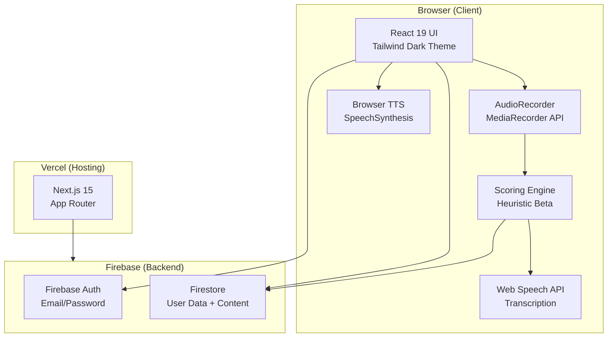
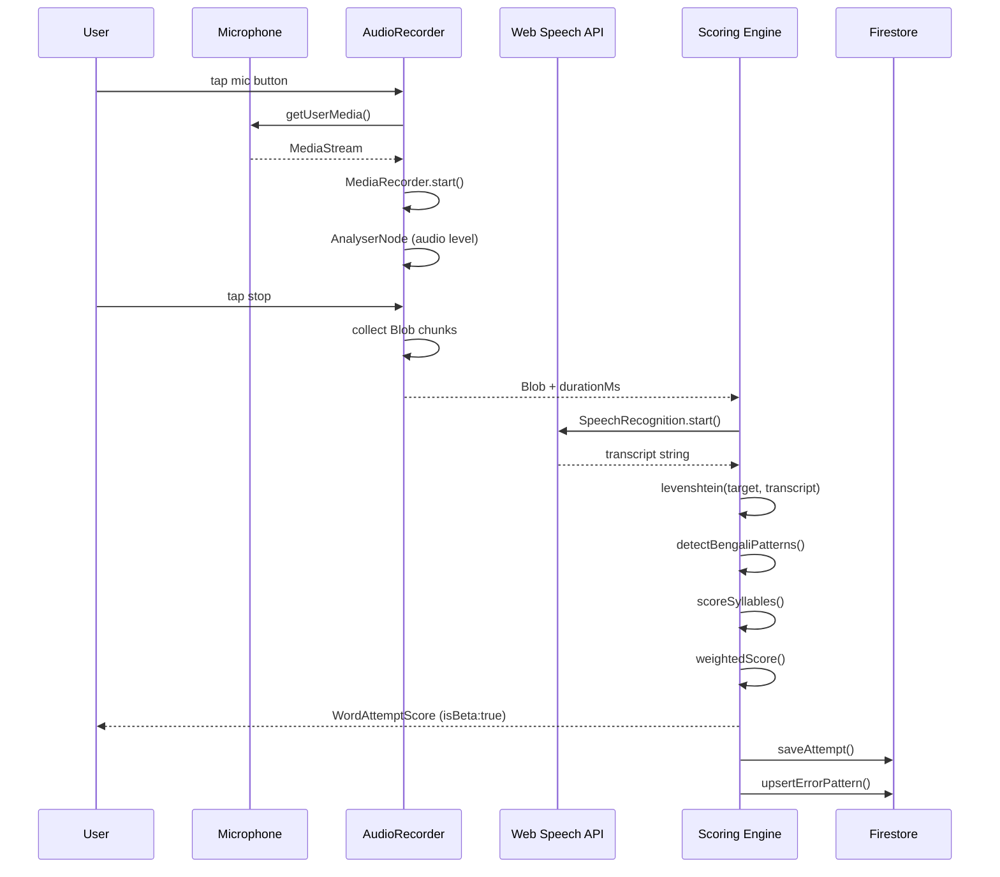
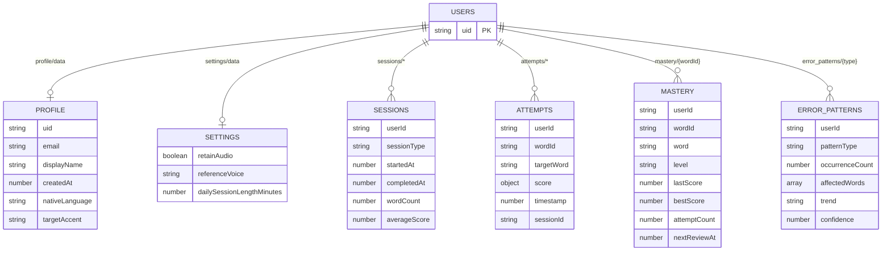
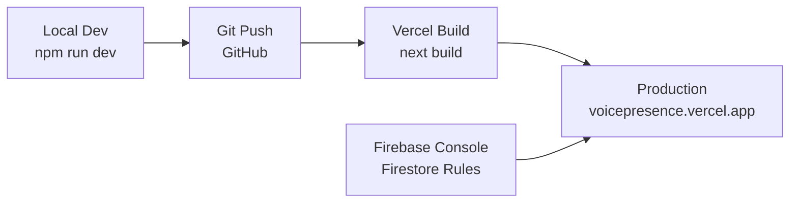

# Architecture — VoicePresence MVP

## System Architecture



## Audio Pipeline



## Firestore Data Model



## Deployment Flow



## Component Hierarchy

```
app/layout.tsx (server)
└── AuthGuard (client) — redirects /login if no session
    └── Navigation (client) — sidebar + mobile bottom bar
        └── [page content]

app/word-lab/page.tsx (client)
├── WordCard (client)
│   ├── AudioRecorderComponent (client)
│   └── ScoreDisplay (client)

app/boardroom/page.tsx (client)
└── AudioRecorderComponent (client)

app/progress/page.tsx (client)
├── ScoreChart (client, recharts)
└── PhonemeHeatmap (client)
```
